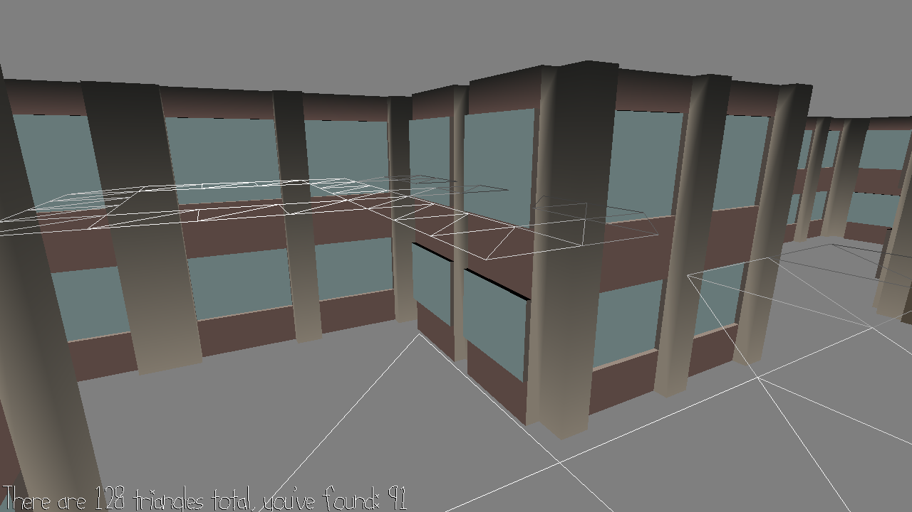

# Fade

Author: Siheng Li

Design: You are trying to map out a city using chalk (obvious vandalism),
but darn, your eyes are really bad (even though it can see through buildings)
and you can only see where you have drawn chalk if it is close to you :(
Try to draw chalk on all 128 triangles (which I am pretty sure is actually not possible).

Screen Shot:

How To Play:
Just walk around, if you step on a new tile it will light up,
step on it again and it will disappear. Try to find a single path
that doesn't double cross and hits all triangles.

Sources: 
 city.blend -- Jim McCann
 Thomas on Discord

This game was built with [NEST](NEST.md).

